# Rising Star Player Images

Images were fetched from Wikipedia/Wikimedia where available. Check `manifest.csv` for source and license metadata.

## Phil Foden
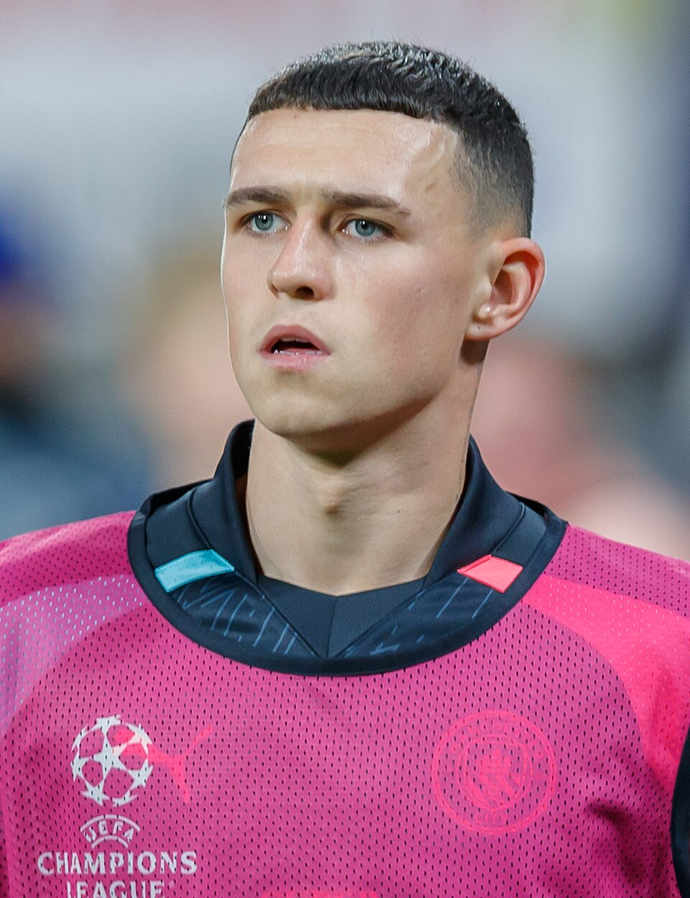
- Source page: https://en.wikipedia.org/wiki/Phil_Foden
- License: CC BY-SA 4.0
- Credit: Steffen Prößdorf

## Jude Bellingham
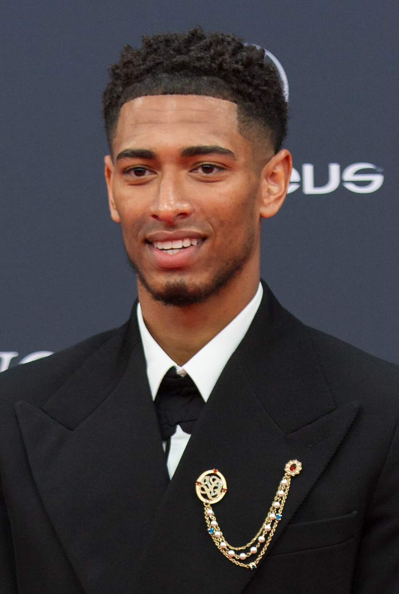
- Source page: https://en.wikipedia.org/wiki/Jude_Bellingham
- License: CC BY-SA 4.0
- Credit: Barcex

## Gavi
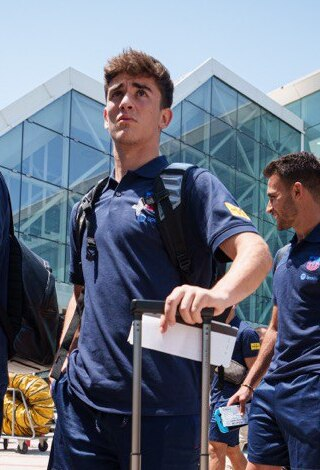
- Source page: https://en.wikipedia.org/wiki/Gavi_(footballer)
- License: Attribution
- Credit: Generalitat de Catalunya

## Pedri
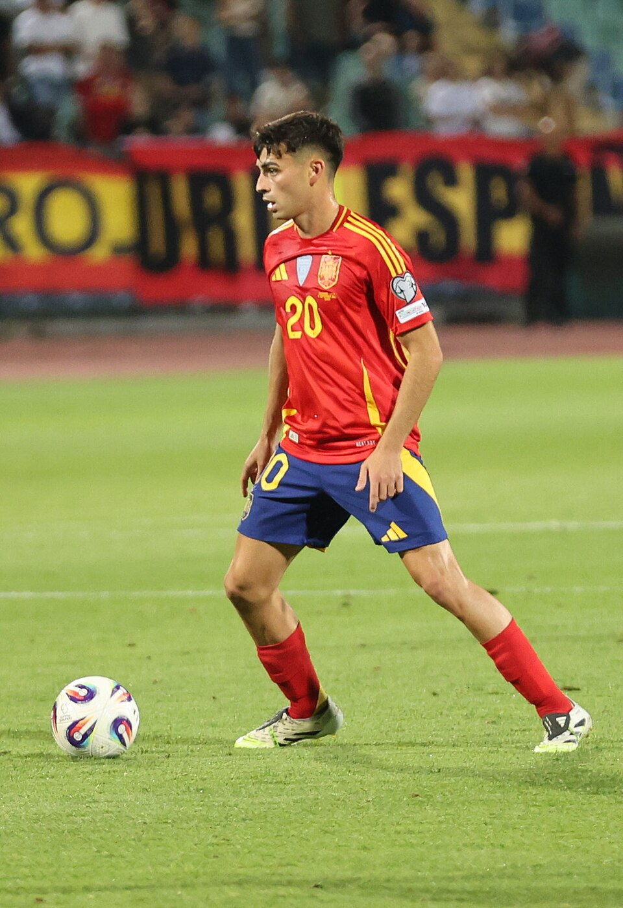
- Source page: https://en.wikipedia.org/wiki/Pedri
- License: CC BY 4.0
- Credit: Biso

## Kylian Mbappé
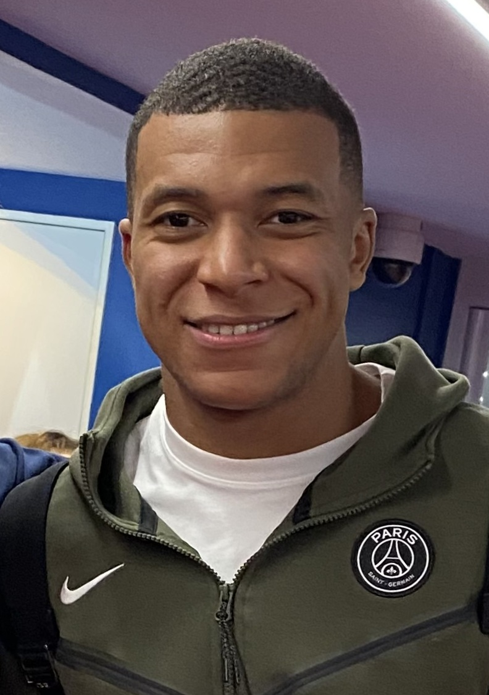
- Source page: https://en.wikipedia.org/wiki/Kylian_Mbapp%C3%A9
- License: CC0
- Credit: Helfer Emilio

## Xavi Simons
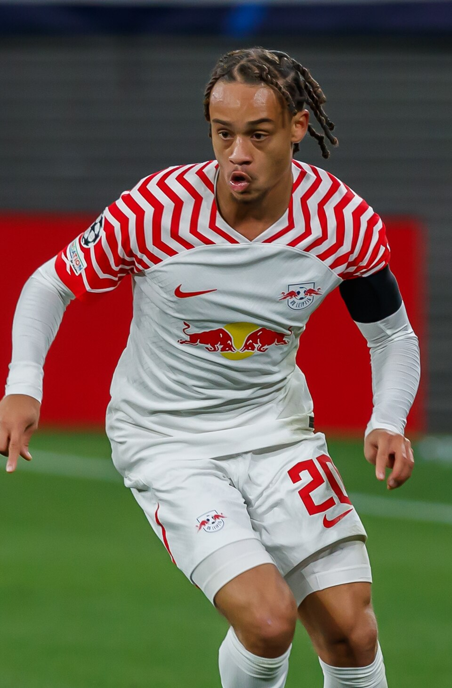
- Source page: https://en.wikipedia.org/wiki/Xavi_Simons
- License: CC BY-SA 4.0
- Credit: Original:  Steffen Prößdorf; Derivative work:  SonoGrazy

## Jamal Musiala
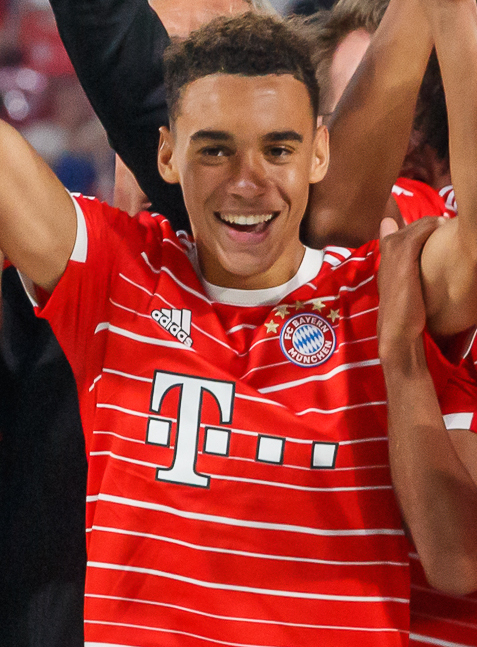
- Source page: https://en.wikipedia.org/wiki/Jamal_Musiala
- License: CC BY-SA 4.0
- Credit: crop by ArsenalGhanaPartey

## Alejandro Garnacho
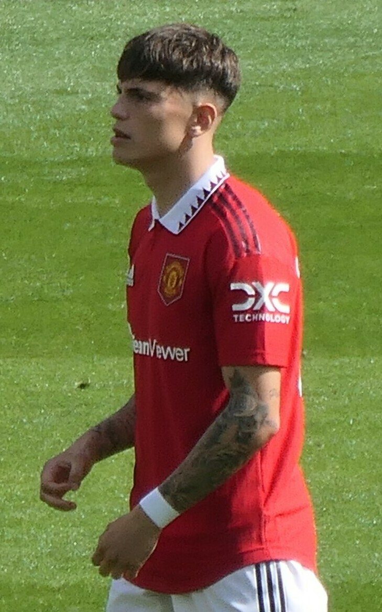
- Source page: https://en.wikipedia.org/wiki/Alejandro_Garnacho
- License: CC BY-SA 4.0
- Credit: Ardfern

## Ryan Gravenberch
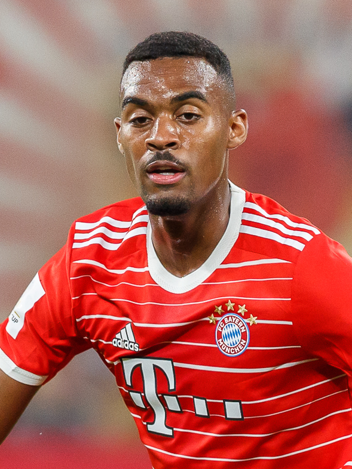
- Source page: https://en.wikipedia.org/wiki/Ryan_Gravenberch
- License: CC BY-SA 4.0
- Credit: crop by Sepguilherme

## Nuno Mendes
- Image status: no_page_image

## William Saliba
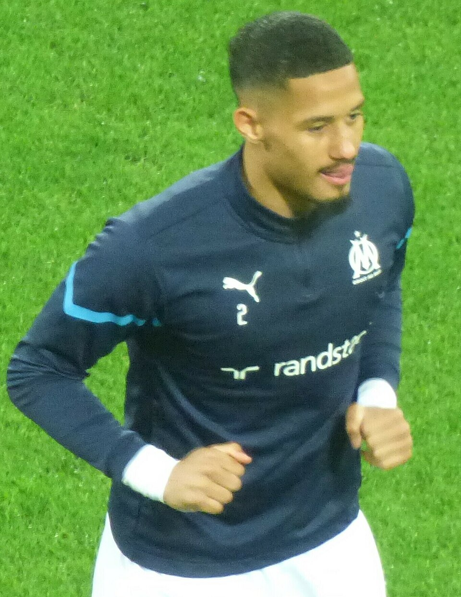
- Source page: https://en.wikipedia.org/wiki/William_Saliba
- License: CC0
- Credit: Supporterhéninois

## Sandro Tonali
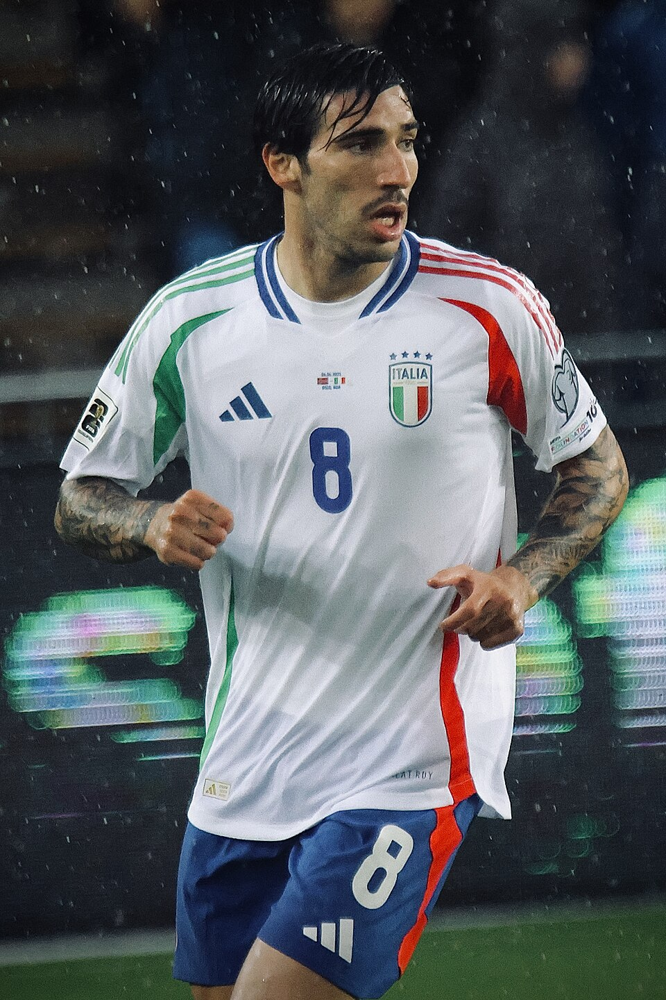
- Source page: https://en.wikipedia.org/wiki/Sandro_Tonali
- License: CC BY 4.0
- Credit: MichaelEmilio
